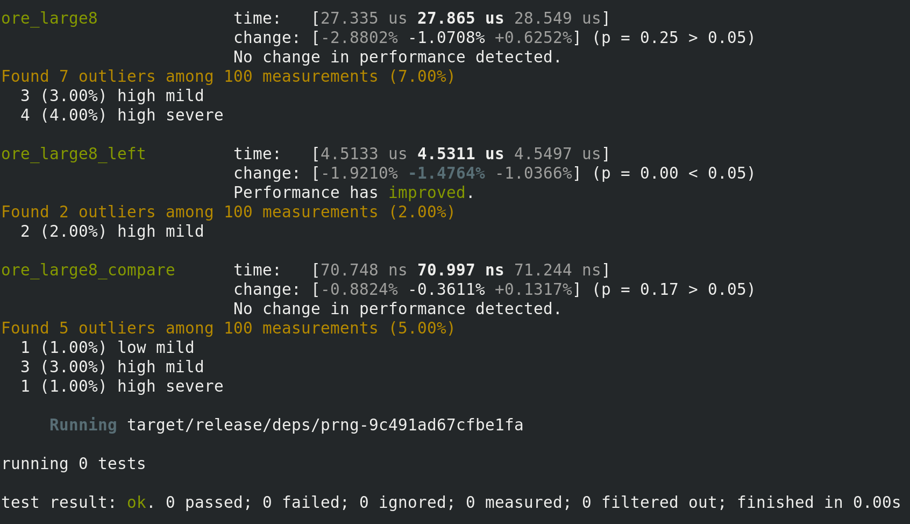

# ORE

This is an Order Revealing Encryption (ORE) library written in Rust and based on the BlockORE Encryption scheme
developed by [Lewi-Wu in 2016](https://eprint.iacr.org/2016/612.pdf).

It makes the following improvements on the original scheme:

* Use of a Knuth (Fisher-Yates) Shuffle for the PRP (instead of a Feistel Network which was found to be insecure for
  small domains, see [Bogatov et al](https://eprint.iacr.org/2018/953.pdf)
* Exclusive use of AES as a Random Oracle
* Pipeline optimisations for higher throughput
* Both SIMD and Neon intrinsic support for `X86_64` and `ARM`
* Inclusion of the block number in block prefixes to avoid repeated prefixes

## Usage

First initalize a cipher via the `ORECipher` trait. We'll use the `OREAES128` implementation here.

```rust
use ore::{bit2::OREAES128, ORECipher};

let mut ore: OREAES128 = ORECipher::init(k1, k2, &seed).unwrap();
```

To encrypt an integer, make sure you to use the `ore::OREEncrypt` trait.
Encryption returns a `CipherText<N>` where `N` is the number of blocks required to encrypt the type.
`CipherText<N>` implements the `PartialOrd` trait so they can be compared directly.

```rust
let a = 47.encrypt(&mut ore).unwrap();
let b = 100.encrypt(&mut ore).unwrap();
let result = a > b;
```

## Modules

### Hash

The Hash module isn't really a hash function but rather models a Random Oracle using AES.

### PRP

Currently implements a Pseudo-Random Permutation of domain size 256 (i.e. for a single byte) using
a Knuth Shuffle.

### PRNG

Pseudo Random Number Generator based on a block cipher (AES) and a given key as the fixed seed.

### PRF

Pseudo Random Function using AES encryptions.

### OreLarge

Large domain (up to `2^64-1`) Block ORE with a single bit indicator function.

## Build, Test and Bench

To build, run:

```
cargo build
```

To test, run:

```
cargo test
```

To run the benchmarks, run:

```
cargo bench
```

Example benchmark results below:



## ARMv8 and M1 Support

ARMv8 and M1 Macs work out of the box but will default to AES in software which is around 4x slower than AES-NI
(at least on the test machine using an Intel i7 8700K).

To take advantage of hardware AES using NEON Intrinsics on ARM, you need to use Rust nightly.

```
asdf install rust nightly
asdf local rust nightly
cargo +nightly bench
```

## TODO

* Constant time analysis to ensure that encryption or comparison time does not vary with input size
* Analysis of PRNG used to seed the Knuth shuffle - we may need more bits to ensure sufficient entropy
* Extraction of encrypt and compare traits to handle different block sizes and domain sizes
* Zeroing and careful cleaning up of memory where appropriate
* Support longer AES keys for the PRF and hash (if possible)
